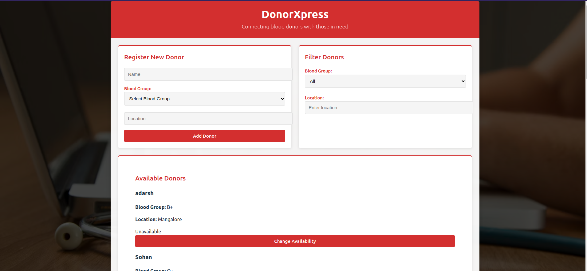

# 🩸 DonorXpress – Blood Donor Finder  

A **MERN stack** application to connect blood donors with those in need. Register donors, filter by blood group, and manage availability status seamlessly.  

---

<p align="center">
  <a href="https://donor-xpress.vercel.app/">
    
  </a>
</p>

---

## ✨ Features  

✅ **Donor Registration** – Add donors with details like name, blood group, location, and availability.  
🔍 **Smart Filtering** – Find donors by specific blood groups (e.g., A+, O-, AB+).  
🔄 **Availability Toggle** – Easily update donor status (Available/Unavailable).  
⚡ **Blazing Fast** – Built with **Vite + React** (Frontend) and **Express + MongoDB** (Backend).  
📱 **Responsive UI** – Works smoothly on all devices.  

---

## 🖥️ Project Preview  

  

---

## 🛠️ Installation  

### **Backend Setup** (`DonorXpress-backend`)  

1. **Navigate & Install Dependencies**  
   ```bash
   cd DonorXpress-backend
   npm install```
   
2. **Create .env file**
   MONGO_URI=mongodb://localhost:27017/donors

3. **Start the server**
    ```bash
    node server.js
    ```

## 💻 Frontend Setup (DonorXpress-frontend)

1. **Install dependencies**

```bash
cd DonorXpress-frontend
npm install
```

2. **Start the React app**

```bash
npm run dev
```

## 🚀 Features
✅ Register blood donors (name, blood group, location, availability)

🔍 Filter donors by blood group

🔄 Toggle donor availability

⚡ Fast and lightweight (Vite, Express)


| Method | Endpoint                | Parameters/Body                          | Description                     |
|--------|-------------------------|------------------------------------------|---------------------------------|
| POST   | `/api/donors`           | `{name, bloodGroup, location, available}` | Register new donor              |
| GET    | `/api/donors?group=A+`  | `group: bloodGroup`                      | Filter by blood type            |
| PATCH  | `/api/donors/:id`       | `{available: boolean}`                   | Toggle availability status      |

## 👥 Contributors

- [Sudheesh](https://github.com/sudheesh)
- [Varadaraj](https://github.com/varadaraj)
- [Yajnesh](https://github.com/yajnesh)
- [Sohan](https://github.com/sohan)
  
<p align="center"> <b>💖 Donate Blood, Save Lives!</b> </p> 
